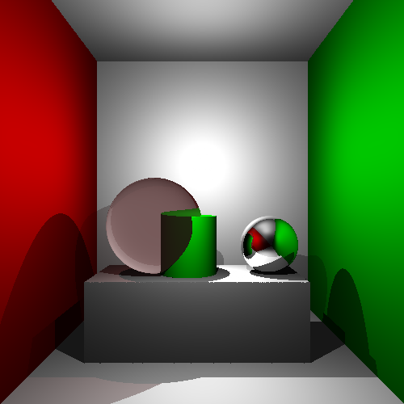
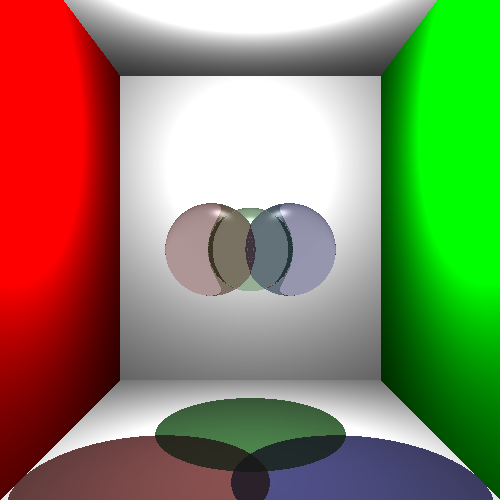
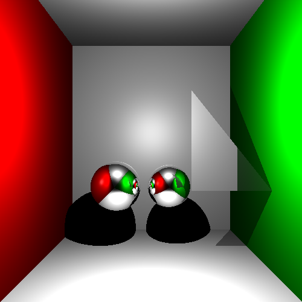
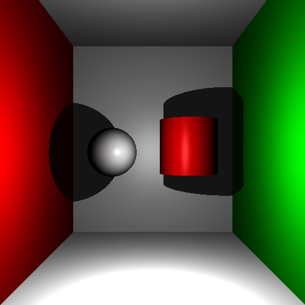

# RayTracing

This is an implementation of the **Ray Tracing rendering algorithm** using C++ and FreeImage. It was made as a two person project for the University course Introduction to Computer Graphics.

## About the Ray Tracing Algorithm

Ray Tracing is used to create an image by calculating and setting the color of each of its pixels. This is done by throwing rays in different directions from the position of the camera, and checking their intersections with the objects defined in a cartesian coordinate system. Then, we see if the point of intersection is iluminated by one of the lights (and how much is it, based on the angle and distance of the light). Objects can be reflective or refractive, and to account for this, the algorithm makes recursive calls to calculate the refractive and reflective light colors.

## About the project

The resolution of the image, and the position and properties of the camera, lights and objects can be configured in the _scene.xml_ file.

The _tinyxml2_ library was used to parse XML files.

In the _images_ folder, an evolution of the results of the algorithm can be seen (the images are named after the date they were created in).

## Some example results

